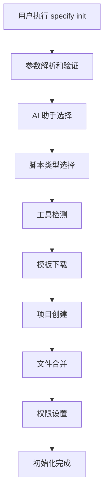
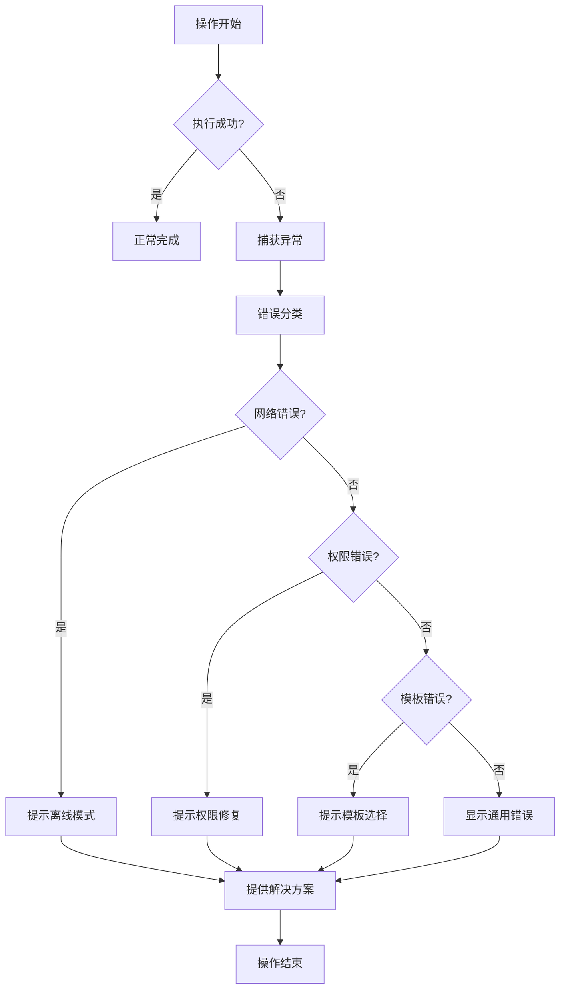

# 代码结构解析

本文档深入分析 Spec Kit 的内部代码结构，帮助开发者理解其实现原理和关键组件。

## 🏗️ 项目整体架构

Spec Kit 采用模块化设计，主要分为以下几个核心部分：

```
spec-kit/
├── src/specify_cli/          # CLI 工具核心实现
│   └── __init__.py           # 主入口文件，包含所有 CLI 命令
├── templates/                # 项目模板文件
├── docs/                    # 文档系统
├── scripts/                 # 自动化脚本
└── specs/                   # 规范定义示例
```

## 🔧 CLI 核心模块分析

### 主入口文件：`src/specify_cli/__init__.py`

这是 Spec Kit 的核心文件，实现了所有 CLI 功能。

#### 1. 依赖管理

```python
# 核心依赖
import typer          # CLI 框架
import rich           # 终端美化
import httpx          # HTTP 客户端
import platformdirs   # 跨平台目录管理
import readchar       # 键盘输入处理
```

#### 2. 配置系统

**AI 助手配置**：
```python
AGENT_CONFIG = {
    "copilot": {
        "name": "GitHub Copilot",
        "folder": ".github/",
        "install_url": None,
        "requires_cli": False,
    },
    # ... 其他 AI 助手配置
}
```

**脚本类型配置**：
```python
SCRIPT_TYPE_CHOICES = {"sh": "POSIX Shell (bash/zsh)", "ps": "PowerShell"}
```

#### 3. 核心类解析

##### `StepTracker` 类

**功能**：跟踪和渲染分层步骤，支持实时自动刷新。

**关键方法**：
- `add(key, label)`: 添加新步骤
- `start(key, detail)`: 标记步骤开始
- `complete(key, detail)`: 标记步骤完成
- `error(key, detail)`: 标记步骤错误
- `render()`: 渲染步骤树状图

**实现原理**：
```python
class StepTracker:
    def __init__(self, title: str):
        self.title = title
        self.steps = []  # 步骤列表
        self.status_order = {"pending": 0, "running": 1, "done": 2, "error": 3, "skipped": 4}
        self._refresh_cb = None  # 刷新回调函数
```

##### `BannerGroup` 类

**功能**：自定义 Typer 组，在显示帮助前显示横幅。

```python
class BannerGroup(TyperGroup):
    def format_help(self, ctx, formatter):
        show_banner()  # 显示横幅
        super().format_help(ctx, formatter)  # 显示标准帮助
```

#### 4. 核心函数解析

##### `download_template_from_github()`

**功能**：从 GitHub 下载模板文件。

**流程**：
1. 调用 GitHub API 获取最新发布信息
2. 查找匹配的模板资源
3. 下载 ZIP 文件
4. 返回文件路径和元数据

**关键代码**：
```python
def download_template_from_github(ai_assistant: str, download_dir: Path, ...):
    # 构建 API URL
    api_url = f"https://api.github.com/repos/{repo_owner}/{repo_name}/releases/latest"
    
    # 发送请求
    response = client.get(api_url, headers=_github_auth_headers(github_token))
    
    # 处理响应
    release_data = response.json()
    assets = release_data.get("assets", [])
    
    # 查找匹配的资源
    pattern = f"spec-kit-template-{ai_assistant}-{script_type}"
    matching_assets = [asset for asset in assets if pattern in asset["name"]]
```

##### `download_and_extract_template()`

**功能**：下载并解压模板到项目目录。

**流程**：
1. 调用 `download_template_from_github()` 下载模板
2. 创建项目目录结构
3. 解压 ZIP 文件
4. 处理嵌套目录结构
5. 设置脚本执行权限

**关键特性**：
- 支持当前目录初始化 (`--here` 参数)
- 自动扁平化嵌套目录
- 智能文件合并（特别是 `.vscode/settings.json`）

##### `merge_json_files()`

**功能**：深度合并 JSON 文件。

**合并策略**：
- 新键：添加
- 现有键：保留，除非被新内容覆盖
- 嵌套字典：递归合并
- 列表和其他值：替换（不合并）

```python
def deep_merge(base: dict, update: dict) -> dict:
    result = base.copy()
    for key, value in update.items():
        if key in result and isinstance(result[key], dict) and isinstance(value, dict):
            result[key] = deep_merge(result[key], value)
        else:
            result[key] = value
    return result
```

#### 5. CLI 命令实现

##### `init` 命令

**功能**：初始化新项目。

**执行流程**：
1. 参数验证和配置
2. AI 助手选择
3. 脚本类型选择
4. 工具检测
5. 模板下载和解压
6. Git 仓库初始化

**关键特性**：
- 交互式 AI 助手选择
- 自动工具检测
- 进度跟踪显示
- 错误处理和回滚

##### `check` 命令

**功能**：检查所需工具是否安装。

**检查内容**：
- Git
- 各种 AI 助手 CLI 工具
- VS Code 编辑器

## 📋 模板系统架构

### 模板结构

每个模板包含以下标准结构：

```
template-name/
├── .specify/               # Spec Kit 配置
│   └── scripts/           # 自动化脚本
├── specs/                 # 规范定义目录
├── src/                   # 源代码目录
├── tests/                 # 测试文件
└── .vscode/              # VS Code 配置
```

### 模板合并策略

当使用 `--here` 参数时，Spec Kit 采用智能合并策略：

1. **目录合并**：如果目标目录已存在，递归合并内容
2. **文件覆盖**：同名文件会被覆盖（有警告）
3. **特殊处理**：`.vscode/settings.json` 会深度合并而非覆盖

## 🚨 错误处理机制

### 网络错误处理

```python
try:
    response = client.get(api_url, timeout=30)
    if response.status_code != 200:
        raise RuntimeError(f"GitHub API returned {response.status_code}")
except Exception as e:
    console.print(f"[red]Error fetching release information[/red]")
    console.print(Panel(str(e), title="Fetch Error", border_style="red"))
    raise typer.Exit(1)
```

### 文件系统错误处理

```python
try:
    with zipfile.ZipFile(zip_path, 'r') as zip_ref:
        zip_ref.extractall(project_path)
except Exception as e:
    if project_path.exists():
        shutil.rmtree(project_path)  # 清理失败的项目目录
    raise typer.Exit(1)
```

## ⚡ 性能优化策略

### 1. 并行处理

- 使用 `httpx` 的流式下载支持大文件
- 进度条显示下载状态
- 异步文件操作

### 2. 缓存策略

- 模板文件本地缓存
- 避免重复下载相同版本
- 智能清理临时文件

### 3. 内存优化

- 流式处理大文件
- 及时释放资源
- 使用生成器处理文件列表

## 🔧 扩展性设计

### 添加新的 AI 助手

1. 在 `AGENT_CONFIG` 中添加配置：
```python
"new_agent": {
    "name": "New AI Assistant",
    "folder": ".new_agent/",
    "install_url": "https://example.com/install",
    "requires_cli": True,
}
```

2. 创建对应的模板文件
3. 模板会自动包含在发布资源中

### 自定义模板

1. 创建模板目录结构
2. 遵循标准文件布局
3. 打包为 ZIP 文件
4. 上传到 GitHub 发布

## 🔒 安全考虑

### 1. 凭证安全

```python
def _github_token(cli_token: str | None = None) -> str | None:
    """返回清理后的 GitHub token（CLI 参数优先）或 None。"""
    return ((cli_token or os.getenv("GH_TOKEN") or os.getenv("GITHUB_TOKEN") or "").strip()) or None
```

### 2. 文件权限

```python
def ensure_executable_scripts(project_path: Path, tracker: StepTracker | None = None):
    """确保 POSIX .sh 脚本有执行权限。"""
    if os.name == "nt":
        return  # Windows: 静默跳过
    # ... 设置执行权限
```

### 3. 输入验证

所有用户输入都经过严格验证，防止路径遍历和其他安全漏洞。

## 🔍 调试和故障排除

### 启用调试模式

```bash
specify init --debug
```

### 环境信息

调试模式会显示：
- Python 版本
- 平台信息
- 当前工作目录
- 网络请求详情

### 常见问题

1. **网络连接问题**：使用 `--offline` 模式
2. **权限问题**：检查文件系统权限
3. **模板不存在**：验证模板名称和版本

## 📊 架构设计原则

Spec Kit 的代码结构体现了以下设计原则：

### 1. 模块化设计
- **功能分离**：CLI、模板、配置等功能清晰分离
- **单一职责**：每个模块专注于特定功能
- **接口清晰**：模块间通过明确定义的接口交互

### 2. 可扩展性
- **插件架构**：易于添加新的 AI 助手和模板
- **配置驱动**：通过配置文件自定义行为
- **开放标准**：支持标准化的模板格式

### 3. 用户体验
- **交互友好**：丰富的终端输出和进度指示
- **错误友好**：详细的错误信息和解决建议
- **渐进式**：从简单到复杂的学习曲线

### 4. 健壮性
- **错误处理**：完善的异常捕获和处理机制
- **资源管理**：及时释放文件和网络资源
- **状态管理**：清晰的步骤跟踪和状态管理

### 5. 性能优化
- **异步处理**：非阻塞的网络和文件操作
- **缓存策略**：智能的模板缓存机制
- **内存优化**：流式处理大文件

## 🎯 核心组件交互流程

### 项目初始化流程



### 错误处理流程



## 📈 性能指标

### 关键性能指标

1. **初始化时间**：从命令执行到项目创建完成的时间
2. **模板下载速度**：网络连接和下载速度
3. **内存使用**：处理大文件时的内存占用
4. **并发性能**：支持多用户同时初始化的能力

### 优化策略

1. **网络优化**：支持断点续传和并行下载
2. **缓存优化**：智能的模板缓存和清理机制
3. **内存优化**：流式处理和及时资源释放
4. **并发优化**：异步操作和资源锁管理

## 🔮 未来扩展方向

### 1. 更多 AI 助手支持
- 支持更多 AI 开发工具
- 提供统一的 AI 助手接口
- 支持自定义 AI 助手配置

### 2. 模板生态系统
- 模板市场和管理平台
- 模板版本控制和更新
- 社区模板贡献机制

### 3. 企业级功能
- 私有模板仓库支持
- 团队协作和权限管理
- 企业级安全特性

### 4. 开发体验优化
- 更丰富的可视化界面
- 智能代码生成和验证
- 集成开发环境插件

## 🎉 总结

通过理解 Spec Kit 的代码结构，开发者可以：

1. **深入掌握工具原理**：理解规范驱动开发的工作机制
2. **定制化开发**：根据需求扩展和定制功能
3. **问题诊断**：快速定位和解决使用中的问题
4. **最佳实践**：遵循良好的架构设计原则

Spec Kit 的架构设计体现了现代软件开发的最佳实践，为规范驱动开发提供了坚实的基础。

---

*现在你已经深入了解了 Spec Kit 的内部架构，可以更好地使用和扩展这个强大的工具了！*